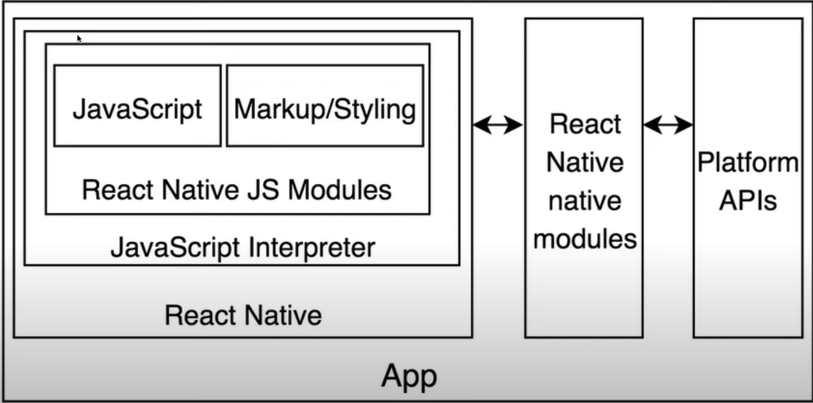

# 1. Introduction

## software 설치

- Android studio, Xcode 같은 것을 설치하지 않고 앱을 핸드폰에서 테스트할 수 있는 것을 사용

## React native 개념

- react native가 내가 짠 javascript 코드를 .apk, .ipa 파일로 컴파일
  - jdk, Android studio, Xcode 등이 필요

## Expo

- https://docs.expo.dev/get-started/installation/
- 작성한 코드의 결과를 앱에서 즉시 확인
- npm install -global expo-cli
- Mac os를 사용 중이라면 Watchman 을 설치
  - brew install watchman
- 핸드폰에 Expo 앱을 설치

## How does React native work

- React native는 브라우저를 사용하지 않음 - bridge를 사용
- 내가 짠 js 코드를 ios, android 코드로 변환

  - IOS와 Android에서 보이는 버튼은 서로 다를 수 있음

- React code -> (React native bridge) -> IOS, Android

- 흐름
  - 1. Native(핸드폰)에서 Event를 받음
  - 2. Bridge를 통해 Serialized payload를 전달
  - 3. Javascript가 이벤트를 처리
    - Native 메소드를 호출하거나 UI를 업데이트 함
  - 4. Bridge를 통해 Serialized batched response가 Native에 전달
  - 5. Native에서 전달 받은 명령을 수행

## Creating the app

- expo init TaehwanGoWeather
  - blank a minimal app as clean as an empty canvas 를 선택
- cd TaehwanGoWeather
- expo login
- npm run start

## Recap

- React native는 브라우저가 아닌 native 앱이다
  - Java 같은 것을 설치해야되는 이유
  - 앱을 만들고 앱을 app store에 내보낼 때 컴파일해야 되기 때문
